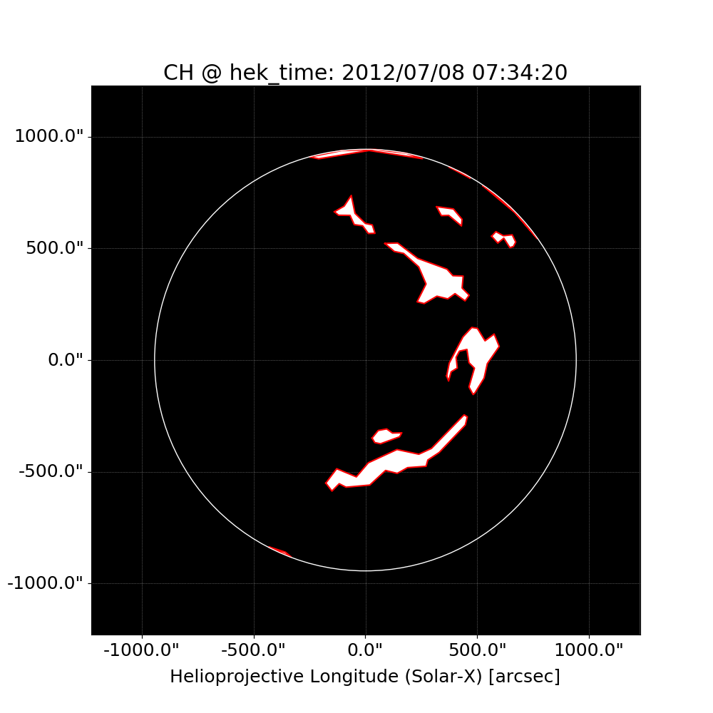
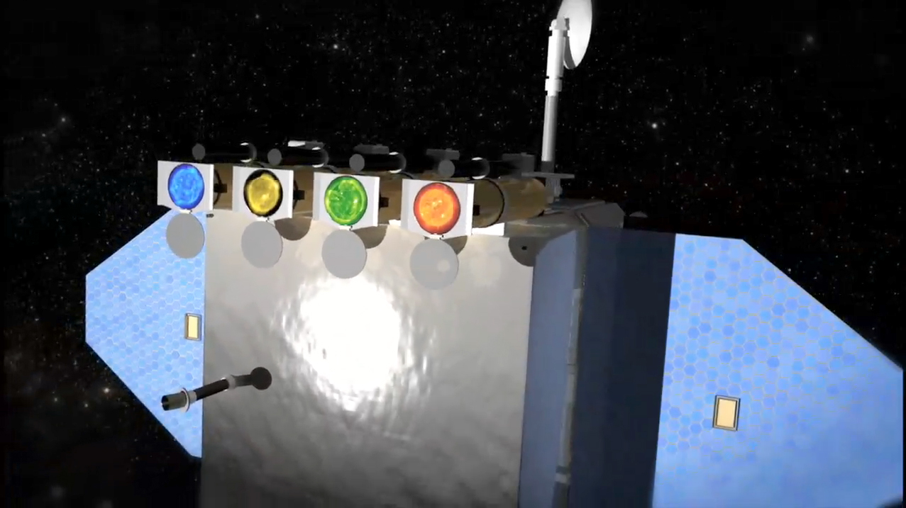
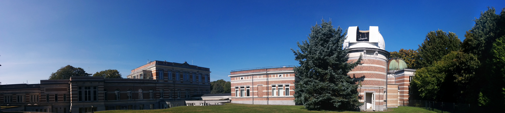

# MachineLearning

## Extracting and Analysing Solar Features With A.I

## Authors: 

Michael Kirk and Raphael Attie @ NASA/GSFC :-)

## Acknowledgements: 

SDO AIA & HMI team:
- https://sdo.gsfc.nasa.gov/mission/science.php

- The HEK of a team at the Royal Observatory of Belgium (ROB)
