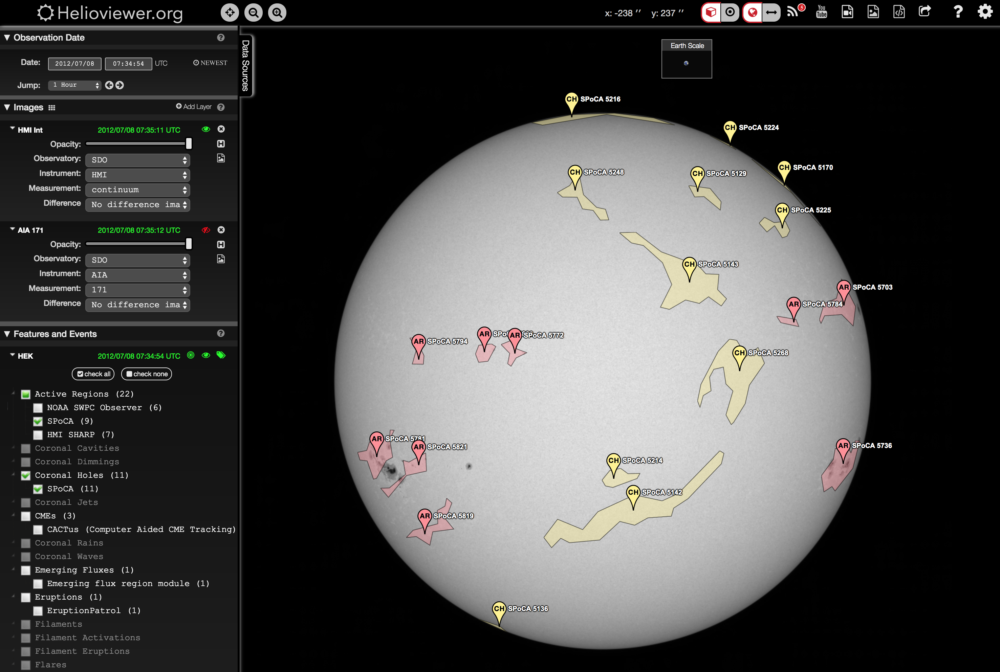

# MachineLearning

## Extracting and Analysing Solar Features With A.I.

## Authors: 

Michael Kirk and Raphael Attie @ NASA/GSFC

## Acknowledgements: 

- SDO, AIA & HMI JSOC team:
    - https://sdo.gsfc.nasa.gov/mission/science.php
    

    - http://jsoc.stanford.edu/

- Heliophysics Event Knowledgebase (aka HEK), Lockheed Martin Solar Applications Laboratory ([LMSAL](https://www.lmsal.com/))

- Feature detection and labeling algorithms by one HEK of a team at the Royal Observatory of Belgium ([ROB](https://www.astro.oma.be/en/))

- JPEG2000 files provided by the ESA and NASA funded [Helioviewer project](https://www.helioviewer.org/)
